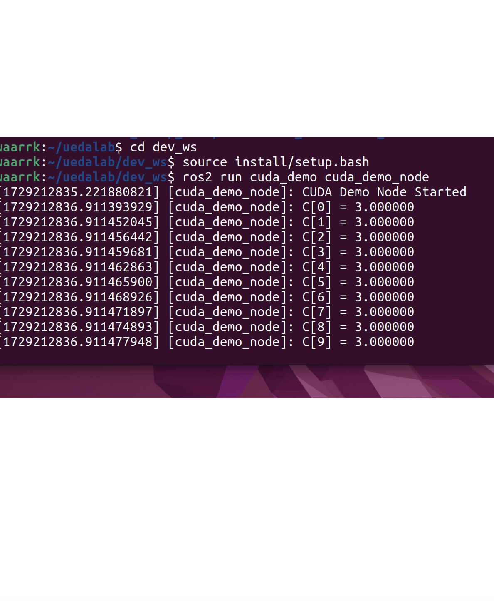
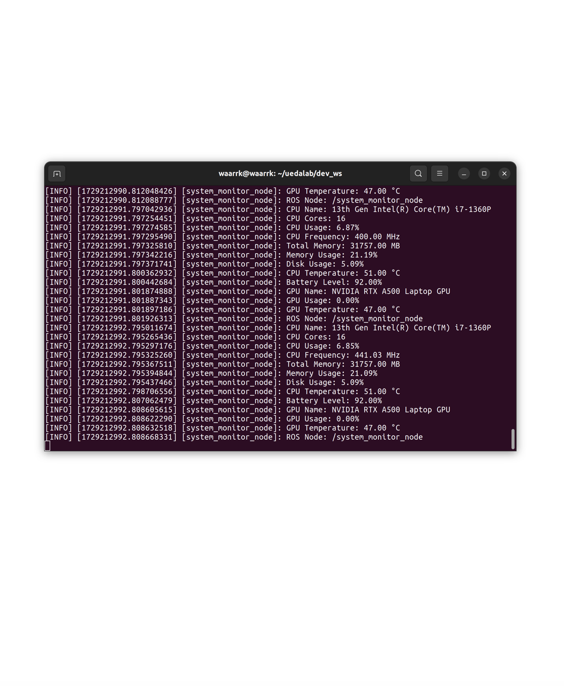

<style scoped>
/* 注意 */
/* VSCodeでプレビューするときは、設定からMarp HTML Enableにすること */
/*タイトルページ用スタイル*/
footer {
    width:100%;
    height: 70px;
    left: 0px;
    bottom: 0px;
    padding-left: 40px;
    background-image: url(./.marp_template_content/logo.png);
    background-repeat: no-repeat;
    background-size: 40%;
    background-position: right 80px bottom 25px;
    display: flex;
    align-items: center;
}
</style>

<style>
/* ページ全体 */
section:not([id="1"]) {
  position: relative;
}

/* ページ番号 */
section:not([id="1"])::after {
  content: attr(data-marpit-pagination) " / " attr(data-marpit-pagination-total);
  font-size: 60%;
}

/* 発表会名 */
section:not([id="1"]) header {
  width: 100%;
  position: absolute;
  top: unset;
  bottom: 21px;
  left: 0;
  text-align: center;
  font-size: 60%;
}

/* 千葉工業大学 上田研究室 */
footer {
  text-align: center;
  font-size: 60%;
}

/* 結論用 */
.conclusion {
  display: inline-block;
  background-color: pink;
  border: none;
  font-weight: bold;
  padding: 5px 10px;
}
</style>

# 自律ロボットの経路計画のための<br>GPUによる高速な価値反復処理の実装

## ROS2ノードにおけるGPUの利用

千葉工業大学 上田研究室 22C1704

2024/10/17 鷲尾 優作

<br />

---

<!-- header: "ゼミ資料" -->
<!-- paginate: true -->

## 目次

1. 背景: 価値反復をロボットの経路計画に適用するROSパッケージ
2. 高速化へのアプローチ: GPUの利用
3. 価値反復ROSパッケージに対するGPUの適用の提案
4. 研究目的
5. ビルド方法の検討
6. `find_library`関数を使用したCUDAのビルド
7. `NVML`を使用したGPUリソースの監視
9. まとめ

---

## 背景: 価値反復をロボットの経路計画に適用するROSパッケージ<br>[1][2]

- 特徴: 環境中でロボットがとりうる全ての位置と向きの状態に対しゴールまでのコ
ストを計算
  - 障害物回避などに流用できる
- 課題:A*等の計画手法より計算量が大きい
  - 状態数（≒空間の広さ）に比例して計算量が増大する特性
    - 他の計画手法より処理時間が長くなる傾向
    - 経路を1つ見つければ良いわけではないので、環境が広大になれば処理時間が増加

<div class="conclusion">
計算を高速化するとより広い環境で適用可能に
</div>

---

## 高速化へのアプローチ: GPUの利用

- GPUによる高速化の例
  - 流体シミュレーションは価値反復と同様に並列処理を多用
    - CPU実装されていた流体シミュレーションに対してGPUを適用し、高速化する研究[3]
      - CPUを使用する従来法とGPU実装の処理時間を比較
        - 処理時間を5.55%に高速化

<div class="conclusion">
価値反復処理もGPUで高速化できる可能性
</div>

---

## 研究目的

### 価値反復を用いた自律ロボットの経路計画をGPUを利用して高速化し<br>より広い環境で適用可能にする

---

## 価値反復ROSパッケージに対するGPUの適用の提案

- 価値反復ROSパッケージにGPUを適用
  - 価値反復処理をGPUで並列化
  - 処理時間の短縮を図ることができるのではないか
- 実装したGPUによる価値反復処理をCPU実装と比較
  - 処理時間の比較
  - 実世界で適用できるか
  - より広い環境での適用

---

## ビルド方法の検討

- 通常GPUを利用するためにはCUDAとよばれるフレームワークを使用
  - CUDAは`nvcc`コマンドを使用してコンパイルする
  - ROS2のノードをCUDAでコンパイルする方法が不明

<div class="conclusion">
ROS2のcolcon buildでCUDAを使用する方法を検討した
</div>

---

## `find_library`関数を使用したCUDAのビルド

- CUDAをCMakeで使用する場合は`find_library`の使用が一般的
  - CUDAのライブラリを探すための記述を追加
  - CUDAのファイルと通常のC++ファイルを同時にビルドする
  - 以下のように記述する
    - `sm_86`の部分は使用するGPUのアーキテクチャに合わせて変更

```cmake
find_package(CUDA REQUIRED)
set(CUDA_NVCC_FLAGS "${CUDA_NVCC_FLAGS} -arch=sm_86")
set(CUDA_SOURCES
  src/xxxx.cu
)
```

---

## ROS2ノードに対するCUDAの適用テスト

- cuda_demoパッケージを作成
  - <https://github.com/waarrk/cuda_demo/>
  - ベクトルの加算を行うCUDAカーネル関数 `vector_add`を作成
    - $\mathbf{A} = [A_1, A_2, \dots, A_N]$ $\mathbf{B} = [B_1, B_2, \dots, B_N]$、結果 $\mathbf{C} = [C_1, C_2, \dots, C_N]$ として$C_i = A_i + B_i \quad \text{for} \quad i = 1, 2, \dots, N$を得るプログラム
  - CUDAカーネル関数を読み込み、入力ベクトルを与えて動作させるC++プログラムを作成

<div class="conclusion">
ビルドが成功し加算が成功すれば、ROS2でのCUDAの適用ができたと判断
</div>

---

## CUDAカーネルテスト結果

- $\mathbf{A} = [1, 1, \dots, 1]$ $\mathbf{B} = [2, 2, \dots, 2]$として、結果 $\mathbf{C} = [3, 3, \dots, 3]$ を得られた
  - CMakeを書くだけで、ROS2ノードにCUDAを適用することが可能であることが確認できた

<div class="conclusion">
ROS2ノードにCUDAを適用することが可能であることが確認できた
</div>



---

## アンチパターン: `CMake3.27`の新機能を使用

- CMakeには、CUDAのビルドをサポートする機能がある
  - これを利用すれば、CUDAを使用するノードをビルドできるのではないか

これまでは`find_library`関数でCUDAのライブラリを探していたが、CMake3.27から
は他の言語と同様に直接サポートされるよう変わったらしい
新しい記法は以下のとおり

```cmake
cmake_minimum_required(VERSION 3.27)
project(PROJECT_NAME LANGUAGES CXX CUDA)
```

<div class="conclusion">
確かに動くがROS2が標準で使用するCMakeより新しいバージョンに更新しなければならないため、他の部分のコンパイル影響が出た
</div>

---

## `NVML`を使用したGPUリソースの監視

- GPUで計算がしたいわけではなく、GPUのリソースを監視するだけの場合
  - `NVML`というライブラリを使用する
- system_monitor_ros2パッケージを作成
  - <https://github.com/waarrk/system_monitor_ros2/>
  - CUDAの関連ライブラリである`NVML`を使用して、GPUのリソースを監視する
    - GPUの名称や使用率、メモリ使用量を読み出す

```cmake
set(NVML_LIB /usr/lib/x86_64-linux-gnu/libnvidia-ml.so)
target_link_libraries(system_monitor_node
  ${cpp_typesupport_target}
  ${NVML_LIB}
)
```

<div class="conclusion">
NVMLのライブラリだけ読み込む場合のCMakeの記述方法を検討
</div>

---

## NVMLテスト結果

- GPUの名称や使用率、メモリ使用量が正常に読み出せた
- CMakeを書くだけで、ROS2ノードにCUDAを適用することが可能であることが確認できた

<div class="conclusion">
ROS2ノードにNVMLを適用することが可能であることが確認できた
</div>



---

## まとめ

- 価値反復を用いたROSパッケージに対してGPUを適用することを提案
- ROS2ノードにCUDAを適用する方法を検討
  - `find_library`関数を使用したCUDAのビルド
  - テスト結果、ROS2ノードにCUDAを適用することが可能であることが確認できた
- システムのCPU使用量やメモリ使用量をpublishする、system_monitor_node に`NVML`で読み出したGPU情報を付加してテスト
- 今後の展望
  - 価値反復ROSパッケージのGPU化方法の検討
    - どこをどう書き直せばいいのかコードリーディングを進める

---

## 参考文献

1. Ryuichi Ueda, Leon Tonouchi, Tatsuhiro Ikebe, and Yasuo
Hayashibara: “Implementation of Brute-Force Value Iteration
for Mobile Robot Path Planning and Obstacle Bypassing”,
Journal of Robotics and Mechatronics Vol.35 No.6, 2023
2. 上田隆一: “value_iteration2: value iteration for ROS 2” value_iteration2
<https://github.com/ryuichiueda/value_iteration2>, 2024
3. 吉田 圭介, 田中 龍二, 前野 詩郎:“GPUによる分流を含む洪水流
計算の高速化”土木学会論文集B1, Vol.71, No.4, I-589-I_594, 2015
4. CMP0146 — CMake 3.30.4 Documentation,
<https://cmake.org/cmake/help/latest/policy/CMP0146.html#policy:CMP0146>,
(Accessed on 10/03/2024)
