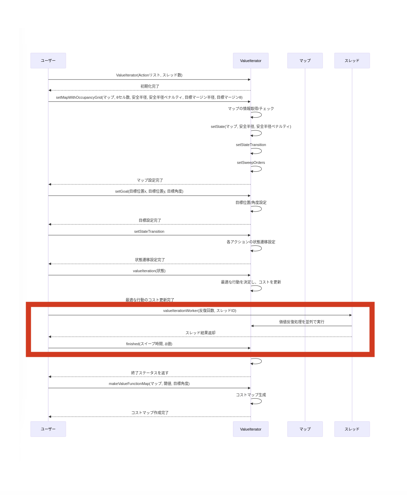

<style scoped>
/* 注意 */
/* VSCodeでプレビューするときは、設定からMarp HTML Enableにすること */
/*タイトルページ用スタイル*/
footer {
    width:100%;
    height: 70px;
    left: 0px;
    bottom: 0px;
    padding-left: 40px;
    background-image: url(./.marp_template_content/logo.png);
    background-repeat: no-repeat;
    background-size: 40%;
    background-position: right 80px bottom 25px;
    display: flex;
    align-items: center;
}
</style>

<style>
/* ページ全体 */
section:not([id="1"]) {
  position: relative;
}

/* ページ番号 */
section:not([id="1"])::after {
  content: attr(data-marpit-pagination) " / " attr(data-marpit-pagination-total);
  font-size: 60%;
}

/* 発表会名 */
section:not([id="1"]) header {
  width: 100%;
  position: absolute;
  top: unset;
  bottom: 21px;
  left: 0;
  text-align: center;
  font-size: 60%;
}

/* 千葉工業大学 上田研究室 */
footer {
  text-align: center;
  font-size: 60%;
}

/* 結論用 */
.conclusion {
  display: inline-block;
  background-color: pink;
  border: none;
  font-weight: bold;
  padding: 5px 10px;
}
</style>

# 自律ロボットの経路計画のための<br>GPUによる高速な価値反復処理の実装

## ROS2ノードの移植状況の報告

千葉工業大学 上田研究室 22C1704

2024/11/17 鷲尾 優作

<br />

---

<!-- header: "ゼミ資料" -->
<!-- paginate: true -->

## 目次

1. 背景: 価値反復をロボットの経路計画に適用するROSパッケージ
2. 高速化へのアプローチ: GPUの利用
3. 価値反復ROSパッケージに対するGPUの適用の提案
4. 研究目的
5. 前回までに行ったこと
6. value_iteration2パッケージの概要
7. ValueIterator.cppのコードリーディング
8. CMakelists.txtの変更
9. value_iteration_kernel.cuの作成
10. 直面している問題（ビルドエラー）
11. まとめ

---

## 背景: 価値反復をロボットの経路計画に適用するROSパッケージ<br>[1][2]

- 特徴: 環境中でロボットがとりうる全ての位置と向きの状態に対しゴールまでのコ
ストを計算
  - 障害物回避などに流用できる
- 課題:A*等の計画手法より計算量が大きい
  - 状態数（≒空間の広さ）に比例して計算量が増大する特性
    - 他の計画手法より処理時間が長くなる傾向
    - 経路を1つ見つければ良いわけではないので、環境が広大になれば処理時間が増加

<div class="conclusion">
計算を高速化するとより広い環境で適用可能に
</div>

---

## 高速化へのアプローチ: GPUの利用

- GPUによる高速化の例
  - 流体シミュレーションは価値反復と同様に並列処理を多用
    - CPU実装されていた流体シミュレーションに対してGPUを適用し、高速化する研究[3]
      - CPUを使用する従来法とGPU実装の処理時間を比較
        - 処理時間を5.55%に高速化

<div class="conclusion">
価値反復処理もGPUで高速化できる可能性
</div>

---

## 研究目的

### 価値反復を用いた自律ロボットの経路計画をGPUを利用して高速化し<br>より広い環境で適用可能にする

---

## 価値反復ROSパッケージに対するGPUの適用の提案

- 価値反復ROSパッケージにGPUを適用
  - 価値反復処理をGPUで並列化
  - 処理時間の短縮を図ることができるのではないか
- 実装したGPUによる価値反復処理をCPU実装と比較
  - 処理時間の比較
  - 実世界で適用できるか
  - より広い環境での適用

---

## 前回までに行ったこと

- ROS2のcolcon buildでCUDAを使用する方法を検討
  - `find_library`関数を使用することが適していることを確認

---

## value_iteration2パッケージの概要

- 価値反復を用いた自律ロボットの経路計画を行うROSパッケージ [2]
  - Action.cpp/State.cpp ロボットが取る行動と状態を定義したクラス
  - StateTransition.cpp 状態遷移を定義したクラス
  - SweepWorkerStatus.cpp 価値反復の進捗状況を保存するクラス
  - ValueIterator.cpp: 価値反復アルゴリズムの実装
  - ValueIteratorLocal.cpp: 局所的な価値反復アルゴリズムの実装
  - vi_node.cpp: プログラムをROS2ノードとして実行するための実装

<div class="conclusion">
CUDA化するにあたって、まずValueIterator.cppから手をつける必要がありそう
</div>

---

## ValueIterator.cpp<br>コードリーディング

`ValueIterator::valueIteration`関数が価値反復のメイン処理

これを、`ValueIterator::valueIterationWorker`経由でvi_node.cppから呼び出すことで並列実行している（赤枠）

<div class="conclusion">
valueIterationをGPUで動作できるように書き換える必要
</div>



---

## CMakelists.txtの変更

- 次のようにCUDAのビルドを追加

```cmake

set(CUDA_NVCC_FLAGS "${CUDA_NVCC_FLAGS} -arch=sm_86")
set(CUDA_SOURCES src/value_iteration_kernel.cu)
cuda_add_library(value_iteration_kernel STATIC ${CUDA_SOURCES})
target_link_libraries(vi_node
  value_iteration_kernel
  rclcpp::rclcpp
)
```

---

## value_iteration_kernel.cuの作成

ValueIterator.cppから、`ValueIterator::valueIteration`を動作させるためにCUDAカーネル化すべきと思われる3関数を移植

- `actionCost`、`valueIterationKernel`、`setStateKernel`を定義
  - `actionCost`は行動のコストを計算（CPU版と同じ）
  - `valueIterationKernel`は価値反復のメイン処理
  - `setStateKernel`は状態を更新（CPU版と同じ）

- ファイルを認識して、CUDAのビルドが走っていることは確認
　- ただし、現在ビルドエラーが発生している

---

## 直面している問題（ビルドエラー）

- CUDAでは、C++のvectorを使用することができない
  - `std::vector`を使用している部分を普通の配列に書き換える必要がある

- 例えば、`Action`クラスの`_state_transitions`を`std::vector`で定義している部分
  - 影響範囲が広いため、書き換えが大変で苦戦中

```cpp
class Action{
public:
 // その他の定義
 std::vector< std::vector<StateTransition> > _state_transitions;
};
```

---

## まとめ

- 価値反復を用いたROSパッケージに対してGPUを適用することを提案
- ValueIterator.cppからCUDA化を進めている
- 現在ビルドエラーが発生している
- ビルドエラーを解消しつつ、ユニットテストを行い、問題が散らからないように移植を進めたい

---

## 参考文献

1. Ryuichi Ueda, Leon Tonouchi, Tatsuhiro Ikebe, and Yasuo
Hayashibara: “Implementation of Brute-Force Value Iteration
for Mobile Robot Path Planning and Obstacle Bypassing”,
Journal of Robotics and Mechatronics Vol.35 No.6, 2023
2. 上田隆一: “value_iteration2: value iteration for ROS 2” value_iteration2
<https://github.com/ryuichiueda/value_iteration2>, 2024
3. 吉田 圭介, 田中 龍二, 前野 詩郎:“GPUによる分流を含む洪水流
計算の高速化”土木学会論文集B1, Vol.71, No.4, I-589-I_594, 2015
4. CMP0146 — CMake 3.30.4 Documentation,
<https://cmake.org/cmake/help/latest/policy/CMP0146.html#policy:CMP0146>,
(Accessed on 10/03/2024)
